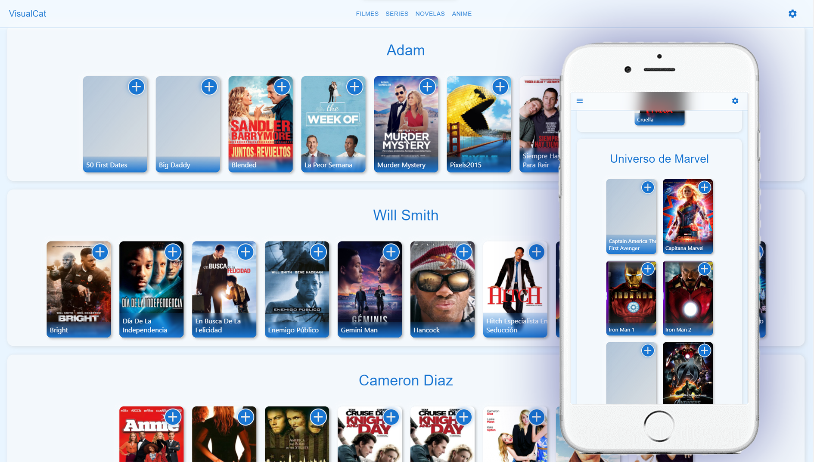
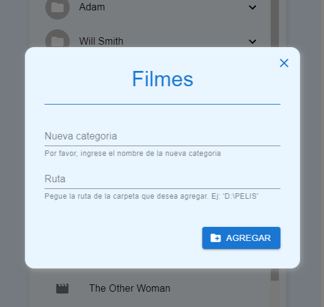

# Visual Cat

Una sencilla PWA (Aplicación web progresiva) para mostrar un catalogo de contenido audiovisual fácil de administrar, con el fin de que el usuario pueda desde cualquier lugar hacer una selección de lo que desea ver, tanto filmes, series, etc.

## Funcionamiento

Desde la interfaz del administrador del sitio (`/manager`) se pueden agregar, editar y eliminar categorías y filmes. Estas modificaciones se harán en el servidor, y luego el usuario podrá ver el resultado en su vista.

Cuadro de dialogo para agregar nueva categoría y los filmes al API

El usuario va seleccionando los filmes que desea ver. Esta selección va directamente a un carrito de compra

Luego al seleccionar dicho carrito, vera una lista modificable de su pedido, y totalizado.

Al trabajar la aplicación con estados, cualquier modificación se reflejara en tiempo real.

## Tecnologías

### Front-end

- **React:** Framework principal
- **Material UI**: Libreria para mostrar elementos de interfaz mas intuitivos para los usuarios.
- **Redux**: Para el manejo del estado global.
- **Axios**: Para peticiones al API

### Back-end

- **Node JS**
- **Express**: Para proporcionar un API Rest
